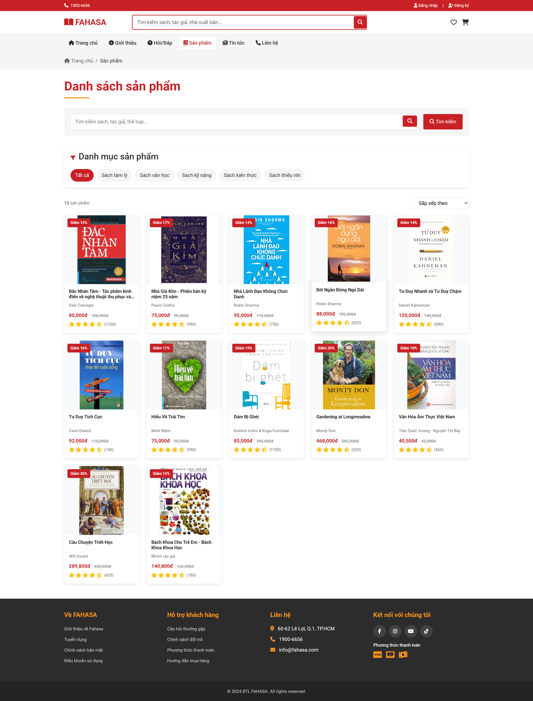
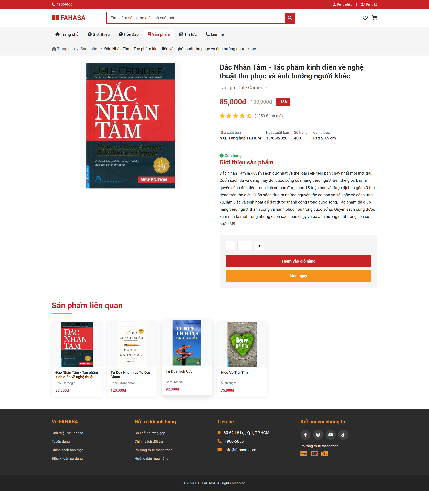
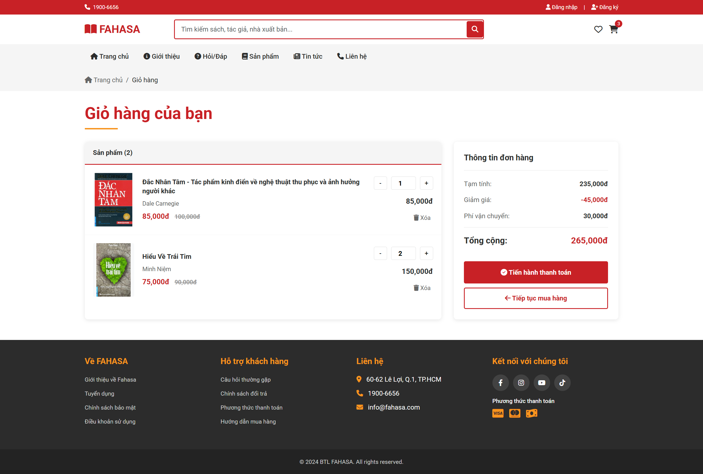
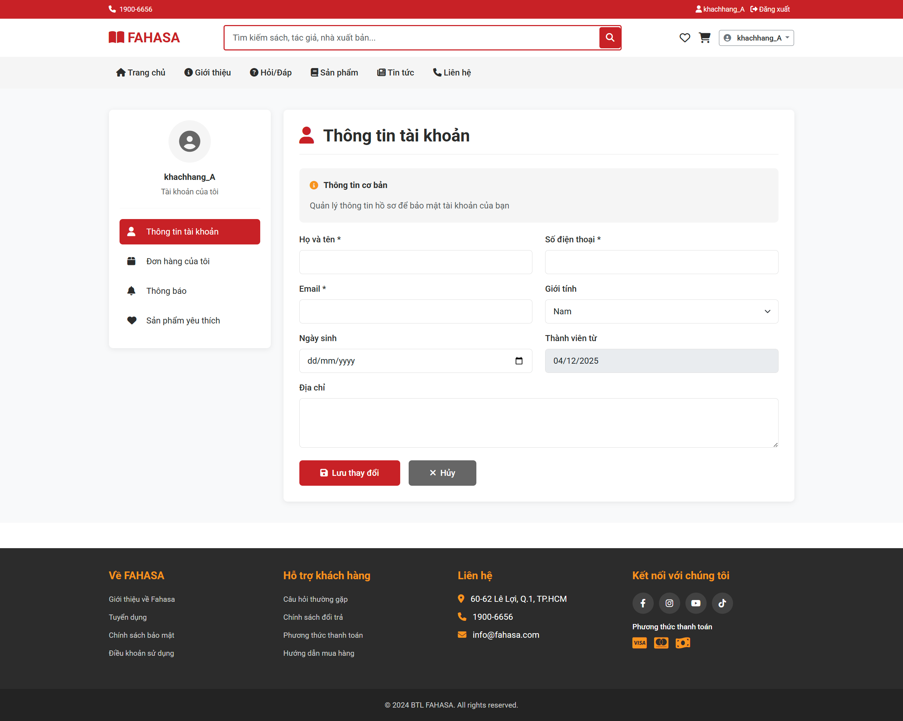
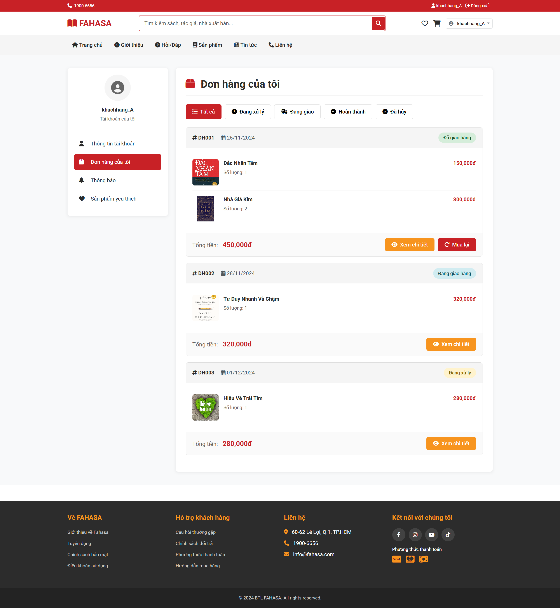
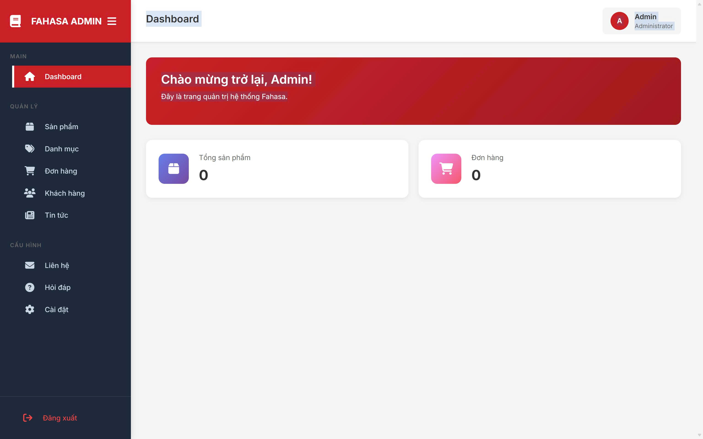
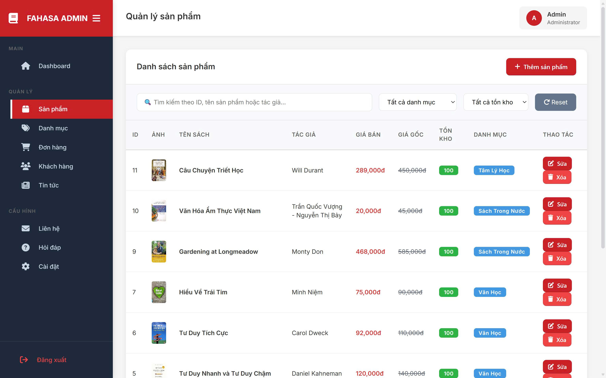
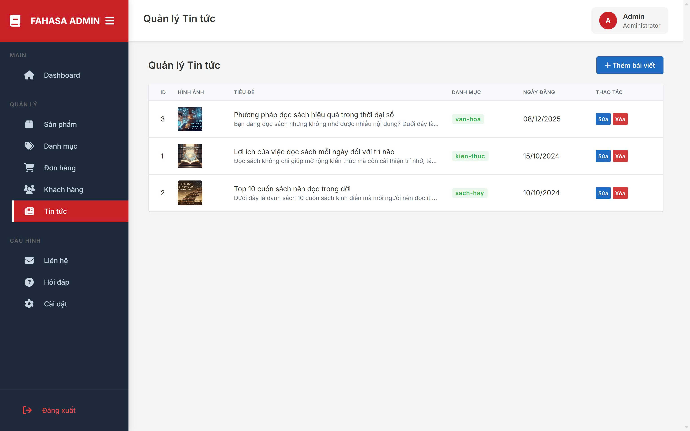

# BTL FAHASA - Website Bán Sách Trực Tuyến

> Dự án Bài Tập Lớn môn Lập Trình Web - Xây dựng website bán sách trực tuyến lấy cảm hứng từ Fahasa.com, sử dụng kiến trúc MVC thuần PHP

[](LICENSE)
[](https://php.net)
[](https://www.mysql.com/)
[](https://getbootstrap.com/)

## 📋 Mô tả dự án

Website bán sách trực tuyến **BTL Fahasa** là một nền tảng thương mại điện tử hoàn chỉnh, được phát triển với mục tiêu học tập và thực hành kiến trúc MVC. Dự án tái hiện các tính năng chính của Fahasa.com với giao diện thân thiện, hiện đại và trải nghiệm người dùng mượt mà.

### Chức năng cho Khách hàng (User)

**Người dùng chưa đăng nhập (Guest):**

- 🏠 Truy cập trang chủ với banner quảng cáo và sản phẩm nổi bật
- 📚 Duyệt danh sách sản phẩm theo danh mục (Grid layout responsive)
- 🔍 Tìm kiếm sản phẩm theo tên, tác giả
- 📖 Xem chi tiết sản phẩm với thông tin đầy đủ
- 📰 Đọc tin tức, bài viết về sách
- ℹ️ Xem trang giới thiệu, hỏi đáp, liên hệ
- 📝 Đăng ký tài khoản mới
- 🔑 Đăng nhập vào hệ thống

**Người dùng đã đăng nhập (Customer):**

- 🛒 Thêm sản phẩm vào giỏ hàng
- ➕➖ Quản lý giỏ hàng (CRUD)
- 💰 Xem tổng tiền tự động khi cập nhật giỏ hàng
- 👤 Xem và chỉnh sửa thông tin cá nhân
- 📦 Xem lịch sử đơn hàng (Tất cả, Đang xử lý, Đang giao, Hoàn thành, Đã hủy)
- ❤️ Quản lý danh sách sản phẩm yêu thích
- 🔔 Nhận thông báo về đơn hàng và khuyến mãi
- 🚪 Đăng xuất khỏi hệ thống

### 🔧 Chức năng cho Admin (Quản trị viên)

**Dashboard & Analytics:**

- 📊 Xem thống kê tổng quan (doanh thu, đơn hàng, sản phẩm, khách hàng)
- 📈 Biểu đồ phân tích doanh số theo thời gian

**Quản lý sản phẩm:**

- ➕ Thêm sản phẩm mới với đầy đủ thông tin
- ✏️ Chỉnh sửa thông tin sản phẩm
- 🗑️ Xóa sản phẩm
- 📁 Quản lý danh mục sản phẩm
- 🖼️ Upload và quản lý hình ảnh sản phẩm

**Quản lý đơn hàng:**

- 👀 Xem danh sách tất cả đơn hàng
- 🔄 Cập nhật trạng thái đơn hàng
- 📋 Xem chi tiết đơn hàng

**Quản lý nội dung:**

- 📰 Thêm/sửa/xóa tin tức và bài viết
- ❓ Quản lý câu hỏi/câu trả lời trong phần Q&A
- 📧 Xem và trả lời các liên hệ từ khách hàng

**Quản lý người dùng:**

- 👥 Xem danh sách khách hàng
- 🔐 Quản lý quyền truy cập (user/admin)
- 🚫 Kích hoạt/vô hiệu hóa tài khoản

**Cấu hình hệ thống:**

- ⚙️ Cấu hình thông tin website
- 📝 Chỉnh sửa nội dung trang tĩnh (About, Contact)

### 💻 Công nghệ sử dụng

**Backend:**

- PHP 7.4+ (thuần, không framework)
- Custom MVC Framework tự xây dựng
- PDO (PHP Data Objects) cho database abstraction
- Session-based authentication

**Database:**

- MySQL 8.0+ / MariaDB
- Thiết kế schema chuẩn hóa với foreign keys
- Indexing cho tối ưu hiệu năng

**Frontend:**

- HTML5 với semantic elements
- CSS3 (Custom styles + Bootstrap 5.3)
- JavaScript (Vanilla JS + AJAX)
- Bootstrap 5.3 - Responsive grid system
- Font Awesome 6 - Icons
- Google Fonts (Roboto)

**Development Tools:**

- XAMPP (Apache + PHP + MySQL)
- Git & GitHub cho version control
- Visual Studio Code / PhpStorm
- LaTeX (Overleaf) cho documentation

**Architecture & Design Patterns:**

- MVC (Model-View-Controller) Pattern
- Repository Pattern cho data access
- Front Controller Pattern (Router)
- Dependency Injection (DI) cơ bản

**Security:**

- PDO Prepared Statements (SQL Injection prevention)
- Password Hashing với `password_hash()` (bcrypt)
- XSS Prevention với `htmlspecialchars()`
- Session Security & Role-based Access Control
- HTTPS ready (SSL/TLS support)

---

## ✨ Đặc điểm nổi bật

### 🏗️ Kiến trúc MVC tự xây dựng

- **Không sử dụng framework** - Code từ đầu để hiểu sâu về MVC
- **Router linh hoạt** - URL-friendly với .htaccess rewriting
- **Base Controller** - Kế thừa và tái sử dụng code
- **Database Abstraction** - PDO wrapper cho queries an toàn

### 🎨 Giao diện & UX

- **Responsive Design** - Tương thích mobile, tablet, desktop
- **Bootstrap 5** - Grid system và components hiện đại
- **Fahasa-inspired** - Màu sắc và layout giống Fahasa.com
- **Font Awesome Icons** - Hơn 2000 icons miễn phí
- **Smooth Animations** - Transitions và hover effects

### 🔒 Bảo mật

- **SQL Injection Protection** - 100% queries dùng prepared statements
- **XSS Prevention** - Escape output trong views
- **Password Security** - Bcrypt hashing với cost factor 10
- **Session Management** - Secure session handling
- **Role-based Access** - Phân quyền user/admin rõ ràng

### 🔍 SEO (Search Engine Optimization)

- **Meta Tags** - Title, Description, Keywords động theo từng trang
- **Open Graph Tags** - Tối ưu khi share lên Facebook, Zalo
- **Twitter Cards** - Hiển thị đẹp khi share lên Twitter
- **Canonical URLs** - Tránh duplicate content
- **robots.txt** - Hướng dẫn search engines crawl website
- **Semantic HTML** - Sử dụng thẻ HTML5 semantic
- **Alt text** - Mô tả cho images (accessibility + SEO)
- **URL-friendly** - Clean URLs với slug

### ⚡ Hiệu năng

- **Lazy Loading** - Tải ảnh khi cần
- **CSS/JS Minification** - Giảm kích thước file
- **Database Indexing** - Tối ưu truy vấn
- **Session Cart** - Giỏ hàng nhanh, không cần database

### 📱 Tính năng nổi bật

- **AJAX Cart** - Cập nhật giỏ hàng không reload trang
- **Search & Filter** - Tìm kiếm và lọc sản phẩm real-time
- **Wishlist** - Lưu sản phẩm yêu thích
- **Order Tracking** - Theo dõi đơn hàng với nhiều trạng thái
- **News System** - Hệ thống tin tức với categories
- **Admin Dashboard** - Panel quản trị đầy đủ tính năng

---

## 🚀 Hướng dẫn cài đặt

### Yêu cầu hệ thống

- PHP >= 7.4
- MySQL/MariaDB
- Apache Server (hoặc XAMPP/WAMP/LAMP)
- Extension: PDO, PDO_MySQL

### Bước 1: Clone/Download dự án

```bash
# Clone từ Git
git clone https://github.com/Binh205/BTL_Fahasa.git

# Hoặc tải về và giải nén vào thư mục htdocs của XAMPP
# Ví dụ: C:/xampp/htdocs/BTL_Fahasa
```

### Bước 2: Import Database

1. Mở phpMyAdmin
2. Tạo database mới tên `fahasa`
3. Import file `db/fahasa.sql`

```sql
# Hoặc chạy lệnh SQL:
CREATE DATABASE fahasa CHARACTER SET utf8mb4 COLLATE utf8mb4_unicode_ci;
USE fahasa;
SOURCE db/fahasa.sql;
```

### Bước 3: Cấu hình Database

Mở file `app/config/config.php` và sửa thông tin database:

```php
// Dòng 10-15: Cấu hình database
define('DB_HOST', 'localhost');
define('DB_USER', 'root');           // ← Sửa username MySQL của bạn
define('DB_PASS', '');               // ← Sửa password MySQL của bạn
define('DB_NAME', 'fahasa');         // ← Tên database
define('DB_PORT', 3307);             // ← Sửa port nếu khác (mặc định máy bình thường: 3306)

// Dòng 23: Sửa tên thư mục dự án
define('PROJECT_NAME', 'BTL_Fahasa'); // ← Tên thư mục trong htdocs
```

### Bước 4: Tạo thư mục upload (nếu chưa có)

```bash
# Tạo thư mục lưu ảnh upload
mkdir public/images/uploads
chmod 755 public/images/uploads
```

### Bước 5: Khởi động server

1. Bật **Apache** và **MySQL** trong XAMPP Control Panel
2. Truy cập: `http://localhost/BTL_Fahasa/public/`

### Bước 6: Đăng nhập Admin (tùy chọn)

Sau khi import database, sử dụng tài khoản admin:

```
Email/SĐT: admin@fahasa.com
Mật khẩu: admin
```

---

## 📁 Cấu trúc thư mục

```
BTL_Fahasa/
├── app/                          # Thư mục chứa code chính
│   ├── config/
│   │   └── config.php           # Cấu hình database, URL, constants
│   ├── controllers/             # Controllers xử lý logic
│   │   ├── HomeController.php   # Trang chủ, giới thiệu, QA
│   │   ├── ProductController.php # Sản phẩm, chi tiết, tìm kiếm
│   │   ├── CartController.php   # Giỏ hàng
│   │   ├── AuthController.php   # Đăng nhập/Đăng ký
│   │   ├── CustomerController.php # Trang cá nhân khách hàng
│   │   ├── AdminController.php  # Quản trị viên
│   │   ├── NewsController.php   # Tin tức
│   │   ├── ContactController.php # Liên hệ
│   │   └── ...
│   ├── core/                    # Core classes của MVC
│   │   ├── App.php             # Router chính, xử lý URL
│   │   ├── Controller.php      # Base Controller
│   │   └── DB.php              # Database wrapper (PDO)
│   ├── models/                  # Models tương tác database
│   │   ├── User.php            # Model User
│   │   ├── Admin.php           # Model Admin
│   │   └── ...
│   ├── views/                   # Views hiển thị giao diện
│   │   ├── components/         # Header, Footer
│   │   ├── home.php            # Trang chủ
│   │   ├── product/            # Trang sản phẩm
│   │   ├── cart/               # Giỏ hàng
│   │   ├── auth/               # Đăng nhập/Đăng ký
│   │   ├── customer/           # Trang cá nhân
│   │   ├── admin/              # Admin panel
│   │   └── ...
│   └── router.php              # Load config và core classes
├── db/                          # Database files
│   └── fahasa.sql              # File SQL dump
├── public/                      # Thư mục public (document root)
│   ├── css/                    # Stylesheets
│   ├── js/                     # JavaScript files
│   ├── images/                 # Hình ảnh
│   │   └── uploads/           # Ảnh upload từ admin
│   ├── .htaccess              # URL rewriting
│   └── index.php              # Entry point
└── README.md                   # File này
```

## 🔗 Cấu trúc URL & Routing

### Trang công khai

| Chức năng         | URL                            | Controller        | Method    |
| ----------------- | ------------------------------ | ----------------- | --------- |
| Trang chủ         | `/public/` hoặc `/public/home` | HomeController    | index()   |
| Giới thiệu        | `/public/home/about`           | HomeController    | about()   |
| Hỏi/Đáp           | `/public/home/qa`              | HomeController    | qa()      |
| Liên hệ           | `/public/contact`              | ContactController | index()   |
| Sản phẩm          | `/public/product`              | ProductController | index()   |
| Chi tiết SP       | `/public/product/detail/1`     | ProductController | detail(1) |
| Tin tức           | `/public/news`                 | NewsController    | index()   |
| Chi tiết bài viết | `/public/news/detail/1`        | NewsController    | detail(1) |

### Giỏ hàng

| Chức năng         | URL                           | Method      |
| ----------------- | ----------------------------- | ----------- |
| Xem giỏ hàng      | `/public/cart`                | GET         |
| Cập nhật số lượng | `/public/cart/updateQuantity` | POST (AJAX) |
| Xóa sản phẩm      | `/public/cart/removeFromCart` | POST (AJAX) |

### Xác thực

| Chức năng | URL                     | Yêu cầu      |
| --------- | ----------------------- | ------------ |
| Đăng nhập | `/public/auth/login`    | -            |
| Đăng ký   | `/public/auth/register` | -            |
| Đăng xuất | `/public/auth/logout`   | Đã đăng nhập |

### Trang khách hàng (Yêu cầu đăng nhập)

| Chức năng           | URL                              |
| ------------------- | -------------------------------- |
| Thông tin tài khoản | `/public/customer`               |
| Đơn hàng của tôi    | `/public/customer/orders`        |
| Sản phẩm yêu thích  | `/public/customer/wishlist`      |
| Thông báo           | `/public/customer/notifications` |

### Trang Admin (Yêu cầu role='admin')

| Chức năng        | URL                      |
| ---------------- | ------------------------ |
| Dashboard        | `/public/admin`          |
| Quản lý sản phẩm | `/public/admin/products` |
| Quản lý tin tức  | `/public/admin/news`     |
| Quản lý Q&A      | `/public/admin/qa`       |
| Quản lý liên hệ  | `/public/admin/contacts` |
| Cấu hình         | `/public/admin/settings` |

---

## 🏗️ Kiến trúc MVC

### Flow hoạt động

```
User Request
    ↓
public/index.php (Entry point)
    ↓
app/router.php (Load config & core)
    ↓
app/core/App.php (Parse URL → Controller/Method/Params)
    ↓
app/controllers/*Controller.php (Xử lý logic)
    ↓
app/models/*.php (Tương tác database) ←→ Database
    ↓
app/views/*.php (Render giao diện)
    ↓
Response to User
```

### Core Classes

**1. App.php** - Router chính

- Parse URL thành `[controller, method, params]`
- Load controller tương ứng
- Gọi method với parameters
- Redirect về landing nếu không tìm thấy

**2. Controller.php** - Base Controller

- `model($name)` - Load model
- `view($view, $data)` - Render view
- `redirect($path)` - Chuyển hướng
- `isPost()`, `isGet()` - Kiểm tra request method

**3. DB.php** - Database wrapper

- PDO với prepared statements
- `query($sql, $params)` - Thực thi truy vấn
- `single($sql, $params)` - Lấy 1 dòng
- `all($sql, $params)` - Lấy tất cả dòng

---

## 🔒 Bảo mật

### Các biện pháp đã áp dụng

✅ **SQL Injection Prevention**

- Sử dụng PDO Prepared Statements
- Bind parameters cho mọi query

✅ **Password Security**

- Hash password với `password_hash()` (bcrypt)
- Verify với `password_verify()`

✅ **XSS Prevention**

- Escape output với `htmlspecialchars()` trong views
- Function helper `e($value)` trong header.php

✅ **Session Security**

- Session-based authentication
- Role-based access control (admin/user)
- Middleware check trong constructor của AdminController và CustomerController

✅ **CSRF Protection (Cần bổ sung)**

- Chưa implement CSRF token cho forms

---

## 📊 Cấu trúc Database

### ERD - Entity Relationship Diagram

Database được thiết kế chuẩn hóa đến dạng chuẩn 3NF (Third Normal Form) với 15+ bảng chính.

### Các bảng chính

**1. users - Quản lý người dùng**

```sql
CREATE TABLE users (
    user_id INT AUTO_INCREMENT PRIMARY KEY,
    fullname VARCHAR(100) NOT NULL,
    email VARCHAR(100) UNIQUE NOT NULL,
    phone VARCHAR(15),
    password VARCHAR(255) NOT NULL,  -- bcrypt hashed
    address TEXT,
    gender ENUM('male', 'female', 'other'),
    birthday DATE,
    role ENUM('user', 'admin') DEFAULT 'user',
    status ENUM('active', 'inactive') DEFAULT 'active',
    created_at TIMESTAMP DEFAULT CURRENT_TIMESTAMP,
    updated_at TIMESTAMP DEFAULT CURRENT_TIMESTAMP ON UPDATE CURRENT_TIMESTAMP,
    INDEX idx_email (email),
    INDEX idx_role (role)
);
```

**2. products - Sản phẩm**

```sql
CREATE TABLE products (
    product_id INT AUTO_INCREMENT PRIMARY KEY,
    name VARCHAR(200) NOT NULL,
    slug VARCHAR(200) UNIQUE,
    description TEXT,
    price DECIMAL(10,2) NOT NULL,
    old_price DECIMAL(10,2),
    discount_percent INT DEFAULT 0,
    image VARCHAR(255),
    category_id INT,
    stock INT DEFAULT 0,
    sold INT DEFAULT 0,
    rating DECIMAL(2,1) DEFAULT 0,
    view_count INT DEFAULT 0,
    status ENUM('active', 'inactive') DEFAULT 'active',
    created_at TIMESTAMP DEFAULT CURRENT_TIMESTAMP,
    FOREIGN KEY (category_id) REFERENCES categories(category_id),
    INDEX idx_category (category_id),
    INDEX idx_price (price),
    INDEX idx_status (status)
);
```

**3. categories - Danh mục sản phẩm**

```sql
CREATE TABLE categories (
    category_id INT AUTO_INCREMENT PRIMARY KEY,
    name VARCHAR(100) NOT NULL,
    slug VARCHAR(100) UNIQUE,
    description TEXT,
    parent_id INT NULL,
    sort_order INT DEFAULT 0,
    FOREIGN KEY (parent_id) REFERENCES categories(category_id)
);
```

**4. orders - Đơn hàng**

```sql
CREATE TABLE orders (
    order_id INT AUTO_INCREMENT PRIMARY KEY,
    customer_id INT NOT NULL,
    total DECIMAL(12,2) NOT NULL,
    status ENUM('pending', 'processing', 'shipping', 'completed', 'cancelled')
           DEFAULT 'pending',
    payment_method ENUM('cod', 'bank_transfer', 'vnpay', 'momo'),
    shipping_address TEXT NOT NULL,
    shipping_phone VARCHAR(15),
    note TEXT,
    created_at TIMESTAMP DEFAULT CURRENT_TIMESTAMP,
    updated_at TIMESTAMP DEFAULT CURRENT_TIMESTAMP ON UPDATE CURRENT_TIMESTAMP,
    FOREIGN KEY (customer_id) REFERENCES users(user_id),
    INDEX idx_customer (customer_id),
    INDEX idx_status (status),
    INDEX idx_created (created_at)
);
```

**5. order_details - Chi tiết đơn hàng**

```sql
CREATE TABLE order_details (
    detail_id INT AUTO_INCREMENT PRIMARY KEY,
    order_id INT NOT NULL,
    product_id INT NOT NULL,
    quantity INT NOT NULL,
    price DECIMAL(10,2) NOT NULL,
    FOREIGN KEY (order_id) REFERENCES orders(order_id) ON DELETE CASCADE,
    FOREIGN KEY (product_id) REFERENCES products(product_id)
);
```

**6. cart - Giỏ hàng**

```sql
CREATE TABLE cart (
    cart_id INT AUTO_INCREMENT PRIMARY KEY,
    customer_id INT NOT NULL,
    product_id INT NOT NULL,
    quantity INT DEFAULT 1,
    created_at TIMESTAMP DEFAULT CURRENT_TIMESTAMP,
    FOREIGN KEY (customer_id) REFERENCES users(user_id) ON DELETE CASCADE,
    FOREIGN KEY (product_id) REFERENCES products(product_id) ON DELETE CASCADE,
    UNIQUE KEY unique_cart_item (customer_id, product_id)
);
```

**7. wishlist - Sản phẩm yêu thích**

```sql
CREATE TABLE wishlist (
    wishlist_id INT AUTO_INCREMENT PRIMARY KEY,
    customer_id INT NOT NULL,
    product_id INT NOT NULL,
    created_at TIMESTAMP DEFAULT CURRENT_TIMESTAMP,
    FOREIGN KEY (customer_id) REFERENCES users(user_id) ON DELETE CASCADE,
    FOREIGN KEY (product_id) REFERENCES products(product_id) ON DELETE CASCADE,
    UNIQUE KEY unique_wishlist_item (customer_id, product_id)
);
```

**8. news - Tin tức/Bài viết**

```sql
CREATE TABLE news (
    news_id INT AUTO_INCREMENT PRIMARY KEY,
    title VARCHAR(200) NOT NULL,
    slug VARCHAR(200) UNIQUE,
    content TEXT,
    image VARCHAR(255),
    author_id INT,
    category VARCHAR(50),
    view_count INT DEFAULT 0,
    status ENUM('draft', 'published') DEFAULT 'draft',
    created_at TIMESTAMP DEFAULT CURRENT_TIMESTAMP,
    updated_at TIMESTAMP DEFAULT CURRENT_TIMESTAMP ON UPDATE CURRENT_TIMESTAMP,
    FOREIGN KEY (author_id) REFERENCES users(user_id),
    INDEX idx_status (status),
    INDEX idx_category (category)
);
```

**9. notifications - Thông báo**

```sql
CREATE TABLE notifications (
    notification_id INT AUTO_INCREMENT PRIMARY KEY,
    customer_id INT NOT NULL,
    title VARCHAR(100),
    content TEXT,
    type ENUM('order', 'promotion', 'system'),
    is_read BOOLEAN DEFAULT FALSE,
    created_at TIMESTAMP DEFAULT CURRENT_TIMESTAMP,
    FOREIGN KEY (customer_id) REFERENCES users(user_id) ON DELETE CASCADE,
    INDEX idx_customer_read (customer_id, is_read)
);
```

**10. contacts - Liên hệ**

```sql
CREATE TABLE contacts (
    contact_id INT AUTO_INCREMENT PRIMARY KEY,
    name VARCHAR(100) NOT NULL,
    email VARCHAR(100) NOT NULL,
    phone VARCHAR(15),
    subject VARCHAR(200),
    message TEXT NOT NULL,
    status ENUM('new', 'processing', 'resolved') DEFAULT 'new',
    created_at TIMESTAMP DEFAULT CURRENT_TIMESTAMP,
    INDEX idx_status (status)
);
```

### Quan hệ giữa các bảng

```
users (1) ----< (N) orders
users (1) ----< (N) cart
users (1) ----< (N) wishlist
users (1) ----< (N) notifications
users (1) ----< (N) news (as author)

products (1) ----< (N) order_details
products (1) ----< (N) cart
products (1) ----< (N) wishlist
products (N) ----< (1) categories

orders (1) ----< (N) order_details
```

### Indexes cho tối ưu hiệu năng

- **Primary Keys:** Tự động indexed
- **Foreign Keys:** Indexed cho JOIN queries
- **Search Fields:** email, slug, status
- **Date Fields:** created_at cho sắp xếp theo thời gian

---

## 🎨 Frontend Stack

### Libraries & Frameworks

- **Bootstrap 5.3** - CSS Framework
- **Font Awesome 6** - Icons
- **Google Fonts** - Roboto font
- **Vanilla JavaScript** - AJAX requests

### Color Scheme (Fahasa Style)

```css
--fahasa-red: #C92127      /* Màu đỏ chủ đạo */
--fahasa-orange: #F7941E   /* Màu cam phụ */
--fahasa-dark: #2C2C2C     /* Màu chữ */
--fahasa-gray: #666666     /* Màu phụ */
--fahasa-light-gray: #F5F5F5 /* Nền sáng */
```

---

## 📝 Quy ước đặt tên

### Controllers

- `{Name}Controller.php`

### Models

- `{Name}.php`

### Views

- File: `lowercase.php`

### Database

- Table: `snake_case`, plural
- Column: `snake_case`

---

## ⚙️ Lưu ý quan trọng

### Cấu hình

1. ✅ **Chỉ cần sửa** `app/config/config.php`
2. ✅ Tên thư mục phải khớp với `PROJECT_NAME`
3. ✅ Bật Apache + MySQL trong XAMPP
4. ✅ Import database `db/fahasa.sql` trước khi chạy
5. ✅ Tạo thư mục `public/images/uploads/` và chmod 755

### Session Cart

- Giỏ hàng lưu trong `$_SESSION['cart']`
- Format: `[product_id => quantity]`
- Không cần đăng nhập để thêm vào giỏ

### Admin Access

- Kiểm tra `$_SESSION['users_role'] === 'admin'` trong constructor
- Redirect về home nếu không phải admin

---

## 🆘 Xử lý lỗi thường gặp

### ❌ Lỗi "Failed to open stream" / "No such file"

**Nguyên nhân:** Sai tên thư mục hoặc sai cấu hình `PROJECT_NAME`

**Giải pháp:**

1. Kiểm tra tên thư mục trong htdocs: `C:/xampp/htdocs/BTL_Fahasa`
2. Mở `app/config/config.php`, sửa dòng 23:
   ```php
   define('PROJECT_NAME', 'BTL_Fahasa'); // Tên phải khớp với thư mục
   ```

---

### ❌ Lỗi "View does not exist"

**Nguyên nhân:** Đường dẫn view không đúng

**Giải pháp:**

1. Kiểm tra file view có tồn tại trong `app/views/`
2. Kiểm tra tên file view trong controller:
   ```php
   $this->view('product/index', $data); // ← Tìm app/views/product/index.php
   ```

---

### ❌ Lỗi "Connection failed" / Database error

**Nguyên nhân:** Chưa khởi động MySQL hoặc sai thông tin database

**Giải pháp:**

1. Bật MySQL trong XAMPP Control Panel
2. Kiểm tra port MySQL (mặc định 3306, có thể là 3307)
3. Mở `app/config/config.php`, kiểm tra:
   ```php
   define('DB_HOST', 'localhost');
   define('DB_USER', 'root');
   define('DB_PASS', '');           // Password MySQL
   define('DB_NAME', 'fahasa');     // Tên database
   define('DB_PORT', 3307);         // Port (3306 hoặc 3307)
   ```
4. Đảm bảo đã import file `db/fahasa.sql` vào phpMyAdmin

---

### ❌ Lỗi "Call to undefined method"

**Nguyên nhân:** Model không có method được gọi

**Giải pháp:**

1. Kiểm tra method có tồn tại trong Model
2. Kiểm tra tên method có đúng không (phân biệt hoa/thường)

---

### ❌ Lỗi 404 / Blank page

**Nguyên nhân:** URL rewriting không hoạt động

**Giải pháp:**

1. Kiểm tra file `public/.htaccess` có tồn tại
2. Bật `mod_rewrite` trong Apache:
   - Mở `httpd.conf` trong XAMPP
   - Tìm dòng `#LoadModule rewrite_module modules/mod_rewrite.so`
   - Xóa dấu `#` để uncomment
   - Restart Apache

---

### ❌ Lỗi upload ảnh

**Nguyên nhân:** Thư mục uploads không tồn tại hoặc không có quyền ghi

**Giải pháp:**

1. Tạo thư mục: `public/images/uploads/`
2. Cấp quyền ghi (Linux/Mac):
   ```bash
   chmod 755 public/images/uploads
   ```
3. Windows: Click phải → Properties → Security → Cho phép Write

---

## 🚀 Phát triển tiếp

### Các tính năng cần bổ sung

- [ ] Tích hợp payment gateway (VNPay, MoMo)
- [ ] Email notification (PHPMailer)
- [ ] CSRF protection
- [ ] Rate limiting
- [ ] Search optimization (Full-text search)
- [ ] Product reviews & ratings
- [ ] Coupon/Voucher system
- [ ] Order tracking
- [ ] Export reports (Excel/PDF)

### Cải tiến hiệu năng

- [ ] Caching (Redis, Memcached)
- [ ] Database indexing
- [ ] Image optimization
- [ ] Lazy loading
- [ ] CDN cho static assets

---

## 🎯 Mục tiêu dự án

### Mục tiêu học tập:

1. ✅ Hiểu và áp dụng kiến trúc **MVC (Model-View-Controller)** trong PHP
2. ✅ Nắm vững các công nghệ frontend: **HTML5, CSS3, JavaScript, Bootstrap 5**
3. ✅ Thực hành xây dựng ứng dụng web **full-stack** hoàn chỉnh
4. ✅ Hiểu về quy trình phát triển phần mềm theo nhóm và Git workflow
5. ✅ Áp dụng các biện pháp **bảo mật web** cơ bản (SQL Injection, XSS, Password Hashing)

### Sản phẩm cuối cùng:

- ✅ Website thương mại điện tử bán sách hoàn chỉnh
- ✅ Tài liệu báo cáo chi tiết về dự án (LaTeX)
- ✅ Source code có cấu trúc rõ ràng, dễ bảo trì
- ✅ Database schema được thiết kế chuẩn hóa

---

## 📸 Screenshots

### Giao diện khách hàng

| Trang chủ                                | Danh sách sản phẩm                              | Chi tiết sản phẩm                               |
| ---------------------------------------- | ----------------------------------------------- | ----------------------------------------------- |
|  |  |  |

| Giỏ hàng                                 | Thông tin tài khoản                                | Đơn hàng                                  |
| ---------------------------------------- | -------------------------------------------------- | ----------------------------------------- |
|  |  |  |

### Giao diện Admin

| Dashboard                                           | Quản lý sản phẩm                                  | Quản lý tin tức                           |
| --------------------------------------------------- | ------------------------------------------------- | ----------------------------------------- |
|  |  |  |

---

## 👥 Nhóm phát triển - L01_6

| Thành viên       | MSSV    | Email              | Nhiệm vụ                     |
| ---------------- | ------- | ------------------ | ---------------------------- |
| **Nguyễn Văn A** | 2211xxx | email@hcmut.edu.vn | Team Lead, Backend, Database |
| **Trần Thị B**   | 2211xxx | email@hcmut.edu.vn | Frontend, UI/UX Design       |
| **Lê Văn C**     | 2211xxx | email@hcmut.edu.vn | Backend, Admin Panel         |

**Giảng viên hướng dẫn:** Nguyễn Hữu Hiếu

---

## 📄 Tài liệu & Báo cáo

### 📚 Documentation

- **Báo cáo LaTeX:** [`L01_Report/main.pdf`](L01_Report/main.pdf) (36 trang)
- **Source LaTeX:** [`L01_Report/`](L01_Report/)
- **Database Schema:** [`db/fahasa.sql`](db/fahasa.sql)
- **API Documentation:** Coming soon

### 📖 Nội dung báo cáo

1. **Giới thiệu** - E-commerce, Fahasa template, mục tiêu dự án
2. **Cơ sở lý thuyết** - HTML5, CSS3, JavaScript, PHP, MVC, Bootstrap
3. **Thiết kế ứng dụng** - Database, MVC architecture, tính năng hệ thống
4. **Hiện thực** - Screenshots, code snippets quan trọng
5. **Hướng dẫn cài đặt** - Chi tiết từng bước
6. **Phân công công việc** - Team contributions
7. **Tài liệu tham khảo** - References

### 🎬 Demo

- **Live Demo:** Coming soon
- **Video Demo:** Coming soon
- **Screenshots:** Xem phần [Screenshots](#-screenshots) ở trên

---

## 🎓 Học hỏi & Tham khảo

### Tài liệu tham khảo chính

1. **PHP Documentation** - https://www.php.net/docs.php
2. **Bootstrap 5 Documentation** - https://getbootstrap.com/docs/5.3/
3. **MySQL Documentation** - https://dev.mysql.com/doc/
4. **MDN Web Docs** - https://developer.mozilla.org/
5. **W3Schools** - https://www.w3schools.com/

### Nguồn cảm hứng

- **Fahasa.com** - https://www.fahasa.com/
- **Tiki.vn** - https://tiki.vn/
- **Shopee.vn** - https://shopee.vn/

### Công cụ & Resources

- **Font Awesome Icons** - https://fontawesome.com/
- **Google Fonts** - https://fonts.google.com/
- **Color Palette** - Fahasa brand colors
- **Stock Images** - Unsplash, Pexels

---

## 📄 License

Dự án này được phát triển cho **mục đích học tập** (Bài Tập Lớn môn Lập Trình Web - HCMUT).

```
Copyright (c) 2024 Nhóm L01_6
Trường Đại học Bách Khoa - ĐHQG TP.HCM

Permission is hereby granted, free of charge, to any person obtaining a copy
of this software for educational purposes only.
```

⚠️ **Lưu ý:** Dự án này chỉ dùng để học tập và nghiên cứu. Không sử dụng cho mục đích thương mại.

---

## 🙏 Lời cảm ơn

Chúng em xin gửi lời cảm ơn chân thành đến:

- **Thầy Nguyễn Hữu Hiếu** - Giảng viên hướng dẫn
- **Khoa Khoa học và Kỹ thuật Máy tính** - BK ĐHQG TP.HCM
- **Fahasa.com** - Nguồn cảm hứng cho giao diện
- **Cộng đồng PHP & Web Development** - Tài liệu và hỗ trợ

---

## 📞 Liên hệ & Hỗ trợ

### Gặp vấn đề?

1. ✅ Kiểm tra phần **[Xử lý lỗi thường gặp](#-xử-lý-lỗi-thường-gặp)** ở trên
2. 📖 Đọc **[Hướng dẫn cài đặt](#-hướng-dẫn-cài-đặt)** chi tiết
3. 🔍 Tìm kiếm trong **Issues** đã có
4. 📝 Tạo **Issue mới** trên GitHub với thông tin chi tiết:
   - Mô tả lỗi
   - Screenshot (nếu có)
   - Môi trường (OS, PHP version, XAMPP version)
   - Steps to reproduce

### GitHub Repository

- **URL:** https://github.com/Binh205/BTL_Fahasa
- **Issues:** https://github.com/Binh205/BTL_Fahasa/issues
- **Pull Requests:** Welcome!

### Liên hệ nhóm phát triển

- **Email:** htbinh205@gmail.com
- **Facebook Group:** [Link]

---

## 🌟 Contributing

Mọi đóng góp đều được chào đón! Nếu bạn muốn cải thiện dự án:

1. Fork repository
2. Tạo branch mới (`git checkout -b feature/AmazingFeature`)
3. Commit changes (`git commit -m 'Add some AmazingFeature'`)
4. Push to branch (`git push origin feature/AmazingFeature`)
5. Tạo Pull Request

### Coding Standards

- Follow PSR-12 cho PHP code
- Use meaningful variable/function names
- Comment code khi cần thiết
- Test trước khi commit

---

## 📈 Changelog

### Version 1.0.0 (2024-12-09)

✅ **Initial Release**

- Hoàn thành tất cả tính năng cơ bản
- Giao diện User hoàn chỉnh
- Admin Panel đầy đủ
- Database schema hoàn thiện
- Documentation đầy đủ (LaTeX Report)

### Future Versions

- [ ] Version 1.1.0 - Payment integration (VNPay, MoMo)
- [ ] Version 1.2.0 - Email notifications
- [ ] Version 2.0.0 - Mobile app (React Native)

---

<div align="center">

**🎉 Chúc bạn triển khai thành công! 🎉**

Made with ❤️ by **Nhóm L01_6** - HCMUT

[⬆ Back to top](#-btl-fahasa---website-bán-sách-trực-tuyến)

</div>
